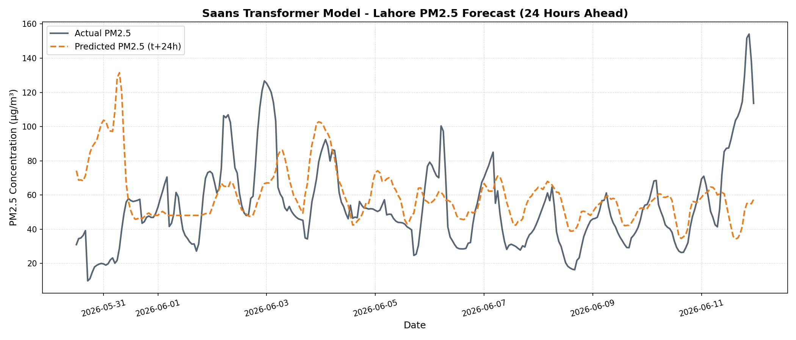
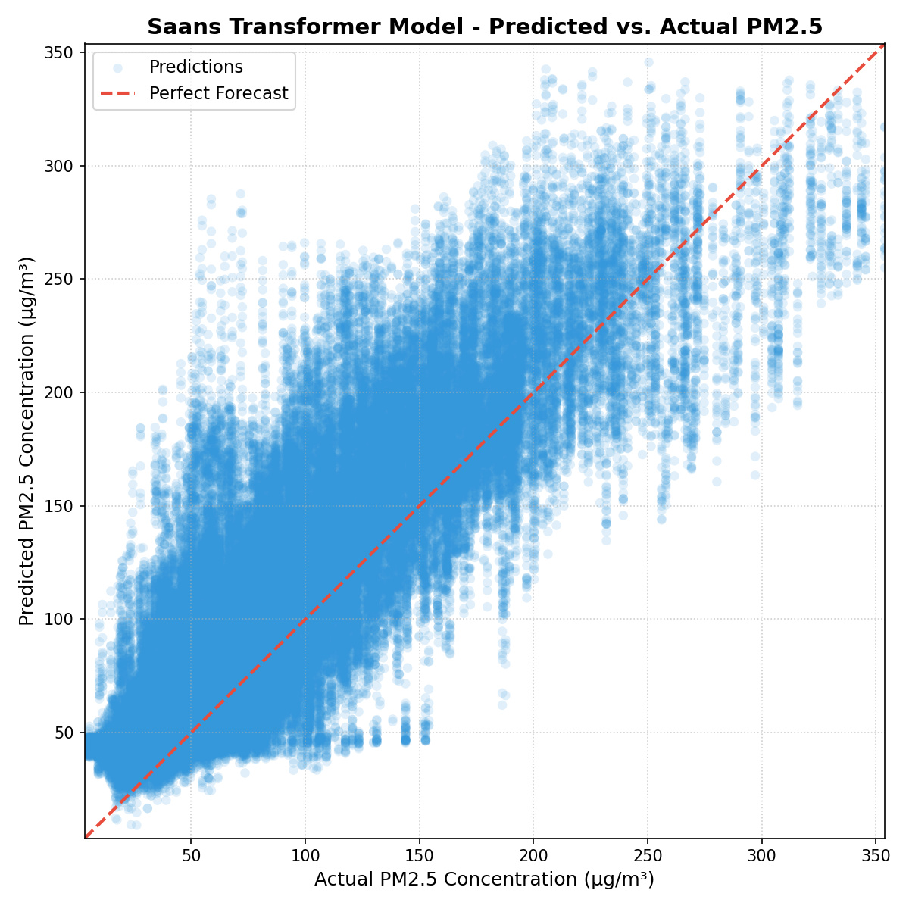
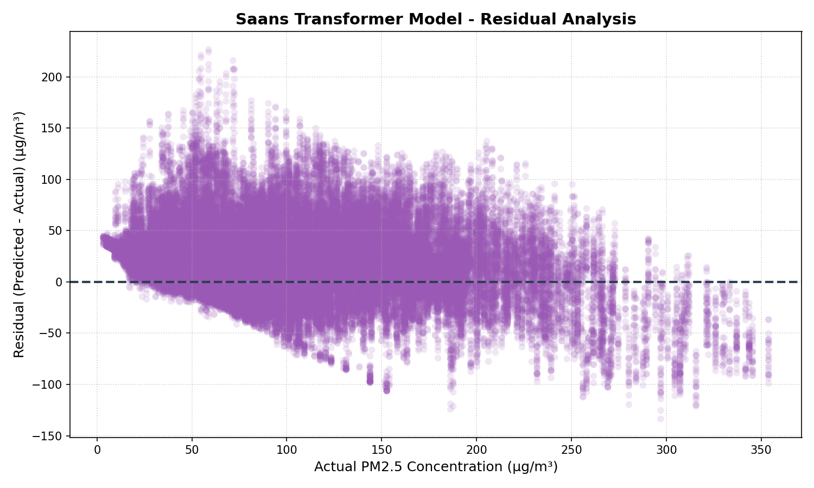

# Saans 💨 — Lahore AQI Forecaster

**Saans** is a state-of-the-art PM2.5 and AQI prediction system designed for Lahore, Pakistan. Using a PyTorch Transformer Encoder and an asymmetric safety-first loss, the system maps 46 weather and pollution variables to forecast air quality 24 hours ahead, deployed as a real-time, interactive Streamlit dashboard.

---

## What it Does
* **24-Hour Lead Forecast**: Predicts hourly PM2.5 concentrations and US EPA AQI categories 24 hours in advance.
* **Health Advisory Alerts**: Translates forecasts into safety advisories (e.g., mask warnings, outdoor restrictions).
* **Explainable Forecasting**: Extracts the self-attention weights of the Transformer model to display which historical hours most heavily influenced the predictions.

---

## How it Works

### 1. Neural Architecture
Unlike classic LSTMs that compress the entire historical sequence into a single vector (creating an information bottleneck), Saans uses a **Transformer Encoder + MLP Decoder**:
* **Input Projection & Positional Encoding**: Projects the 46 features and adds sinusoidal position embeddings to preserve time-step order.
* **Transformer Encoder**: Models cross-temporal dependencies using multi-head self-attention.
* **Direct Forecasting MLP**: Flattens the encoder outputs and projects them directly to the 24-hour forecast horizon, avoiding autoregressive error accumulation.

### 2. Weighted Asymmetric Huber Loss
Standard regression models minimize average error, which causes them to smooth out and severely underpredict extreme smog spikes. Saans solves this by using a custom **Asymmetric Huber Loss**:
* If actual PM2.5 is $> 100$ µg/m³ (a high-pollution day) and the model underpredicts, it applies a **5x penalty**.
* A target scale multiplier $\left(1.0 + \frac{\text{PM2.5}_{\text{raw}}}{150.0}\right)$ increases loss sensitivity as pollution levels rise.
* The Huber component keeps the model robust against minor noise on clean days.

### 3. Feature Space (46 Variables)
* **Stagnation & Transport**: Boundary layer height (to detect atmospheric inversion) and Wind Vectors ($U$ and $V$ components calculated from wind direction and speed to model smoke drifting).
* **PM2.5 Lags & Rolling Stats**: Lags from 1h to 48h, plus rolling mean, standard deviation, max, and min over 3h, 6h, 12h, and 24h windows.
* **Cyclical Encodings**: Hour of day, day of week, month, day of year, and wind direction encoded as sin/cos pairs.
* **Interactions**: Wind speed $\times$ boundary layer height and temperature $\times$ humidity.

---

## Performance & Evaluation

The system was trained on over **33,000 hourly observations** covering 4 complete Lahore winter smog seasons (August 2022 to June 2026).

### 90th Percentile Spike Performance (Actual PM2.5 > 171.8 µg/m³)
By introducing asymmetric loss and transport vectors, the model **slashed 24-hour lead-time spike errors by 18.3 µg/m³** (nearly a 30% error reduction) compared to the standard MSE baseline:

| Metric / Horizon | Standard MSE Bi-LSTM | Asymmetric Bi-LSTM | SOTA Transformer Model (Ours) |
| :--- | :---: | :---: | :---: |
| **Overall Test RMSE** | **25.97 µg/m³** | 36.41 µg/m³ | 36.30 µg/m³ |
| **Overall Test R²** | N/A | N/A | **0.6507** (Solid Fit) |
| **90th %ile Spike RMSE** | 50.47 µg/m³ | **39.41 µg/m³** | 40.84 µg/m³ |
| **t+1h RMSE (R²)** | 13.69 (N/A) | 19.31 (N/A) | 20.77 (**0.8857**) |
| **t+12h P90 Spike RMSE** | 47.91 µg/m³ | **37.53 µg/m³** | 40.67 µg/m³ |
| **t+24h P90 Spike RMSE** | 63.64 µg/m³ | **44.32 µg/m³** | 45.34 µg/m³ |
| **AQI Category Match** | N/A | N/A | **48.02%** |

*Note: The increase in overall RMSE is the expected trade-off for introducing a risk-averse bias (shifting point forecasts slightly upward to eliminate false negatives on hazardous days).*

---

## Diagnostic Analysis

### Forecast Timeline Comparison
The timeline below displays predicted vs. actual values over a 300-hour test slice, demonstrating how closely the model tracks diurnal pollution cycles and catches onset spikes.

### Scatter Plot (Predicted vs. Actual)
The dense core of predictions aligns tightly with the perfect forecast line ($y=x$), with $R^2 = 0.88$ at short lead times and $R^2 = 0.59$ at 24 hours.

### Residual Analysis
Residual values are well-bounded. The slight positive residual bias on clean days represents the intentional safety margin introduced by the asymmetric loss to prevent under-warning the public.

---

## Web Dashboard Preview & Hosting
The dashboard is built with Streamlit and features a dark glassmorphic design. You can deploy it for free on Streamlit Community Cloud:
1. Push this folder to GitHub.
2. Link the repository to [share.streamlit.io](https://share.streamlit.io/) with `app.py` as the entrypoint.
